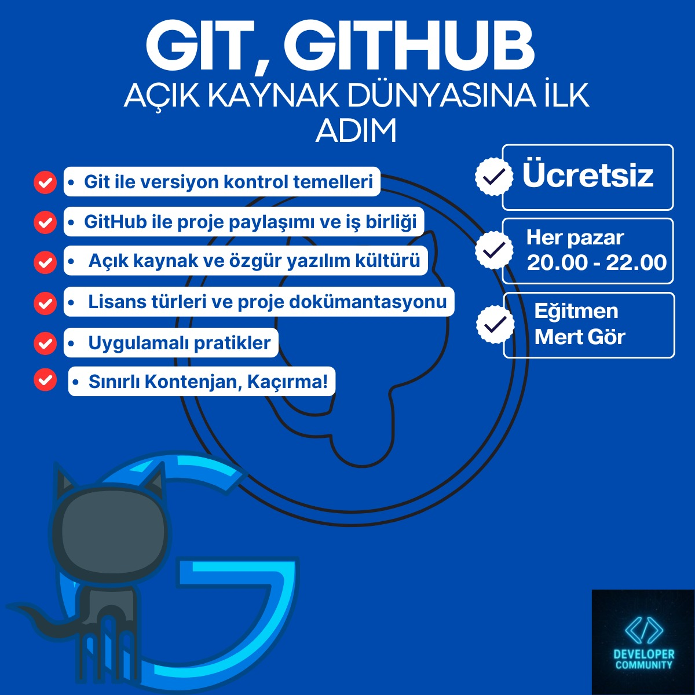

# Git ve GitHub Eğitimi

🚨 ÜCRETSİZ GİT & GITHUB EĞİTİMİ – SIFIRDAN VERSİYON KONTROL 🚨

Developer Community olarak yazılım geliştiriciler için vazgeçilmez bir eğitim daha getiriyoruz!

Git & GitHub bilmeyenler için özel hazırlanan eğitimimiz başlıyor! 🎉

👨‍🏫 Eğitmen: Mert Gör

📅 Başlangıç: 24 Ağustos 2025 (Pazar)

🕒 Saatler: 20:00 – 22:00

🎯 Seviye: Hiç Git/GitHub bilmeyen katılımcılar için

💡 Eğitimde Neler Öğreneceksiniz?

•⁠ ⁠Git nedir, ne işe yarar?

•⁠ ⁠Versiyon kontrol mantığı.

•⁠ ⁠Git kurulumu ve temel komutlar.

•⁠ ⁠Branch, Merge, Commit, Pull, Push işlemleri.

•⁠ ⁠GitHub kullanımı ve proje yönetimi.

•⁠ ⁠Takım çalışmasında GitHub iş akışları.

•⁠ ⁠Gerçek projeler üzerinden uygulamalı anlatım.

•⁠ ⁠%80 katılımla katılım sertifikası.

•⁠ ⁠Eğitim kayıt altına alınmayacaktır.

🎟️ Kontenjan Sınırlı!

📌 Katılım Şartları:

1️⃣ Developer Community LinkedIn sayfasını takip et.

2️⃣ Bu gönderiyi beğen, yorum yap (“+” bile yeterli) ve yeniden paylaş (repost).

3️⃣ Başvuru formunu eksiksiz doldur.

🔗 Başvuru Formu:  https://docs.google.com/forms/d/e/1FAIpQLSf8SQXtSyQJOuHFo7a5Fz62VNKlRRluFGHx9lb2i9fQbL1pBw/viewform

🔗 LinkedIn Sayfamız: https://www.linkedin.com/company/developer-community-turkey/

🔗 Whatsapp Grubumuz: https://chat.whatsapp.com/L85LvFajwyIBRoibH4Ht7e?mode=ems_wa_t

📢 Yazılım dünyasında öne çıkmak istiyorsan Git & GitHub bilmek şart! 🚀

#Git #GitHub #ÜcretsizEğitim #DeveloperCommunity
